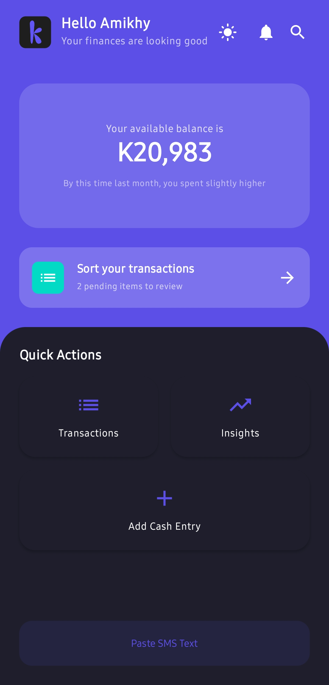
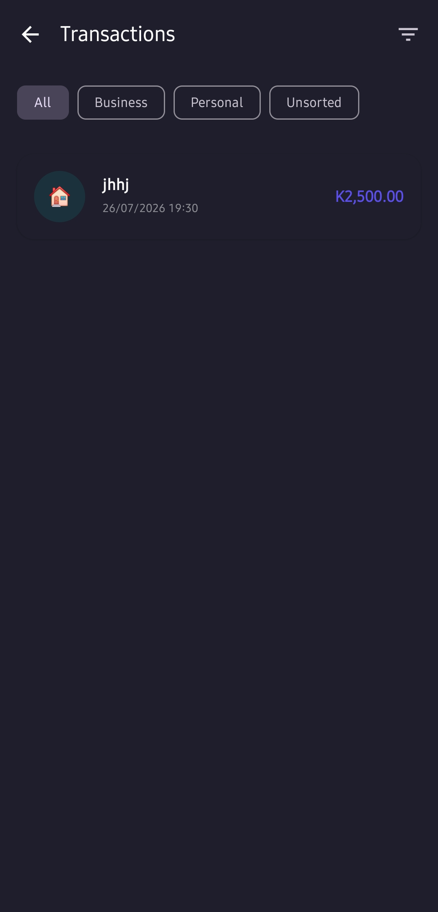
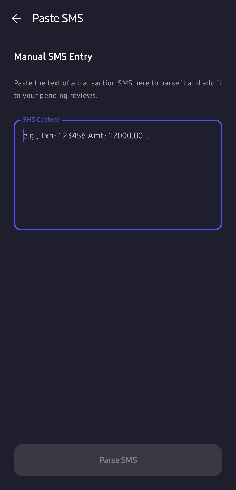
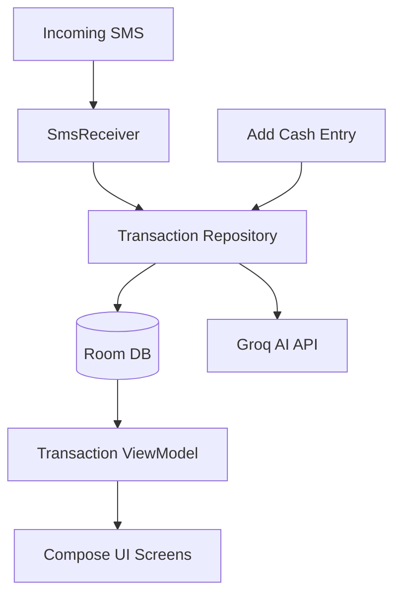

# KwachaWise

**Financial inclusion through intelligent, automated record-keeping.**

*   **Team Name:** Kwacha Wise
*   **University:** University Of Malawi (UNIMA)
*   **Team Members:**
    *   Thokozani Mofolo - Project Manager / Group Leader
    *   Mike Prosper Kamanga (Github username: bsc-inf-09-24) - UI/UX Designer & Frontend Developer
    *   Patrick Solomon (Github username: Patisto) - Backend Developer
    *   Denis Decal - Business Strategist
    *   Dominic Smith - Research Lead

---

## Table of Contents
1. [Overview](#overview)
2. [Live Demo / Showcase](#live-demo--showcase)
3. [Key Features](#key-features)
4. [Screenshots](#screenshots)
5. [Technologies Used](#technologies-used)
6. [Architecture](#architecture)
7. [Setup & Installation](#setup--installation)
8. [Business Model Summary](#business-model-summary)
9. [Challenges & Lessons Learned](#challenges--lessons-learned)
10. [AI Usage Disclosure](#ai-usage-disclosure)
11. [Team & Contribution](#team--contribution)

---

## Overview

KwachaWise is an AI-powered Android application designed to help Malawian micro-entrepreneurs bridge the gap between informal financial activity and formal credit readiness. It automatically transforms everyday mobile money and cash transactions into structured, clean financial records.

### Problem Statement
Most micro-SMEs in Malawi conduct business through Airtel Money, TNM Mpamba, and cash. Because these transactions are often mixed with personal expenses and lack formal documentation, banks and micro-lenders view these businesses as "high-risk" or "unbanked." Without verifiable financial history, viable businesses are locked out of the formal credit market.

### Proposed Solution
KwachaWise provides a "bookkeeping-on-autopilot" solution. By intercepting transaction SMS alerts and providing an easy interface for manual cash entry, the app segregates business from personal spending. It then leverages LLMs (Large Language Models) to generate credit-worthiness insights and actionable financial coaching, turning raw data into a professional financial profile.

---

## Live Demo / Showcase

*   **Live App URL:** [TODO: Hyperlink to APK download or Play Store if available]
*   **Demo Description:** Visitors can install the app to experience the automated SMS capture, manual cash entry flow, and the AI-driven insights dashboard.
*   **Demo Video (5-min):** [TODO: Link to YouTube/Vimeo demo video]

---

## Key Features

*   **Automated SMS Transaction Capture:** Background listener extracts transaction amounts and reference numbers from Airtel Money, TNM Mpamba, and Bank SMS alerts using optimized regex.
*   **Intelligent Classification Queue:** A "Review Pending" feed allows users to categorize transactions as "Business" or "Personal" with a single tap.
*   **Manual Cash Entry:** A dedicated form to capture informal cash sales and expenses that don't leave a digital trail.
*   **AI Financial Health Insights:** Uses the Groq Llama 3.1 model to analyze transaction history and provide a health signal (Healthy/Watch/At Risk) with personalized recommendations.
*   **Offline-First Architecture:** All financial records are stored locally using Room (SQLite), ensuring the app works in areas with poor connectivity.
*   **Theme-Aware Branding:** A professional, production-grade light and dark theme system for comfortable use in any lighting condition.

---

## Screenshots

| Landing Page | Dashboard | Transactions |
| :---: | :---: | :---: |
|  |  |  |

### AI Workflow & SMS Capture

*Example of a SMS being parsed and categorized.*

---

## Technologies Used

*   **Frontend/Mobile:** Kotlin, Jetpack Compose, Material3
*   **Architecture:** MVVM (Model-View-ViewModel)
*   **Local Database:** Room Persistence Library (SQLite)
*   **Asynchronous Logic:** Kotlin Coroutines & Flow
*   **AI/LLM Inference:** Groq Cloud API (Llama 3.1 8B Instant)
*   **Networking:** Retrofit & OkHttp
*   **Persistence:** Jetpack DataStore (Preferences)
*   **Hardware/OS Integration:** Android `BroadcastReceiver` for SMS Capture

---

## Architecture

KwachaWise follows a robust MVVM architecture to ensure scalability and maintainability.

1.  **Data Layer:** Room handles local storage, while the `GroqClient` manages AI requests.
2.  **Repository Layer:** The `TransactionRepository` acts as the single source of truth, mediating between the database and the UI.
3.  **UI Layer:** Jetpack Compose screens observe `StateFlow` from ViewModels, ensuring the UI is always reactive to data changes.

A simple summary diagram:


---

## Setup & Installation

### Quick Install (Recommended)
KwachaWise is packaged as an APK for easy installation — no build tools required.

1.  **Download the APK:** [TODO: Paste APK download link here]
2.  Enable **"Install from Unknown Sources"** in your Android device settings (if prompted).
3.  Open the downloaded file and follow the on-screen prompts to install.
4.  Launch KwachaWise and start tracking your business transactions.

> **Note:** The AI Financial Health Insights feature requires an internet connection to reach the Groq API. All other features work fully offline.

### Running from Source (For Developers)
If you want to test the app live in development, modify the code, or contribute, follow these steps instead:

#### Prerequisites
*   Android Studio Ladybug (or newer)
*   JDK 17 or 21
*   Android Device/Emulator running API 26 (Oreo) or higher
*   Groq API Key (for insights)

#### Environment Variables
The app requires an API key for Groq. In a production environment, this is managed via secure build config or a backend proxy. For the hackathon build:
1.  Open `android/app/src/main/java/com/example/kwachawise/data/GroqClient.kt`
2.  Locate the `API_KEY` placeholder.
3.  Replace with your valid Groq API key: `TODO: SECURE_THIS_DURING_CI`

#### Installation Steps
1.  **Clone the Repo:**
    ```bash
    git clone https://github.com/TODO_USER/finovate-kwacha-wise.git
    cd finovate-kwacha-wise/android
    ```
2.  **Build the Project:**
    Open the project in Android Studio. Gradle will automatically sync and download dependencies.
3.  **Run the App:**
    Click the **Run** button in Android Studio or use the CLI:
    ```bash
    ./gradlew installDebug
    ```

---

## Business Model Summary

### Problem
Most Malawian SMEs lack organized and verifiable financial records, making it difficult for banks to assess their creditworthiness. This limits access to formal financing despite SMEs contributing roughly 70% of Malawi's GDP.

### Solution
KwachaWise is an AI-powered Android application that automatically converts SMS transaction notifications from Airtel Money, TNM Mpamba, and banks into organized financial records. It also allows users to record cash transactions, separate business from personal expenses, and generate financial reports and a Credit Readiness Score.

### Target Customers
**Primary**
*   Small and Medium Enterprises (SMEs)

**Secondary**
*   National Bank of Malawi
*   Other commercial banks
*   Microfinance institutions
*   SACCOs

### Value Proposition
**For SMEs**
*   Automatic bookkeeping
*   Better financial discipline
*   Cash flow insights
*   Business performance reports
*   Credit Readiness Score
*   Easier loan applications

**For National Bank of Malawi**
*   Better-quality borrower information
*   Reduced lending risk
*   Faster loan assessment
*   Increased financial inclusion
*   New bankable customers

### Revenue Model
*   Premium subscription for advanced financial reports
*   Referral commissions from partner banks for successful loan applications
*   Merchant partnerships and business insights services
*   Enterprise licensing for banks and financial institutions

### Key Partners
*   National Bank of Malawi
*   Airtel Money
*   TNM Mpamba
*   Reserve Bank of Malawi
*   SME associations
*   Business development organizations

### Key Activities
*   SMS transaction processing
*   AI-powered transaction categorization
*   Financial report generation
*   Credit Readiness Score calculation
*   Customer support
*   Continuous AI improvement

### Key Resources
*   Android application
*   AI engine
*   Secure cloud database
*   Development team
*   Banking and mobile money SMS data

### Channels
*   Google Play Store
*   National Bank branches
*   SME workshops
*   Business associations
*   Social media
*   Entrepreneurship programs

### Cost Structure
*   App development
*   Cloud hosting
*   AI model maintenance
*   Customer support
*   Marketing
*   Security and compliance

### Social Impact
*   Increased financial inclusion
*   Improved financial literacy
*   Higher SME survival and growth
*   More businesses accessing formal credit
*   Job creation
*   Contribution to Malawi's digital economy

### Impact & Future Scalability

**Impact**
KwachaWise empowers Malawian MSMEs by transforming everyday financial transactions into organized, verifiable business records. This improves financial management, encourages better saving and spending habits, increases financial literacy, and helps businesses become credit-ready. For banks, it reduces information gaps, supports more informed lending decisions, and expands financial inclusion by bringing previously underserved businesses into the formal financial system.

**Future Scalability**
Following the hackathon, KwachaWise can be expanded by:
*   Integrating directly with Airtel Money, TNM Mpamba, and commercial bank APIs
*   Introducing AI-powered budgeting and business coaching
*   Supporting digital invoicing and inventory management
*   Enabling direct loan applications through partner banks
*   Expanding to other African countries with similar mobile money ecosystems

### Future Roadmap
**Phase 1 (Hackathon MVP)**
*   SMS transaction tracking
*   Cash recording
*   Expense categorization
*   Dashboard
*   Credit Readiness Score

**Phase 2**
*   Mobile Money API integration
*   Bank account synchronization
*   Budget planning
*   Financial goal tracking

**Phase 3**
*   Loan application integration with banks
*   AI business advisor
*   Tax reporting
*   Invoice generation

---

## Challenges & Lessons Learned

*   **LLM Language Limitations:** We originally planned to train a custom model for Chichewa financial SMS. Due to hackathon time constraints, we utilized Groq-hosted models. We discovered that standard models (like Llama 3.1) sometimes struggle with the nuances of Malawian SMS shorthand and mixed Chichewa/English contexts, affecting parsing accuracy.
*   **Future Work:** We aim to fine-tune a specialized language model (e.g., a LoRA adapter) specifically on Malawian mobile money message datasets to improve extraction reliability.
*   **Permission Handling:** Managing restricted `RECEIVE_SMS` permissions on modern Android versions required significant research into compliance and fallback UI.

---

## AI Usage Disclosure

This project utilized AI assistance (Claude/Gemini) for:
*   Boilerplate UI generation in Jetpack Compose.
*   Complex Regex generation for multi-provider SMS parsing.
*   Refining the technical documentation and business strategy.
The team has reviewed, tested, and understands all generated code and can explain its implementation logic in detail.

---

## Team & Contribution

*   **Thokozani Mofolo:** PM, Group Leader, Presenter
*   **Mike Prosper Kamanga:** Frontend Developer & UI/UX Designer (Architecture & Design)
*   **Patrick Solomon:** Backend Developer (Database & App Logic)
*   **Denis Decal:** Business Strategist (Revenue Model & Pitch)
*   **Dominic Smith:** Research Lead (Malawian SMS Datasets & Financial Compliance)

**GitHub Workflow:** We utilized a feature-branch workflow. All features were developed in isolation and merged into `main` via Pull Requests after passing build checks.